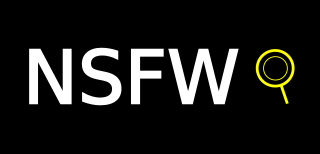
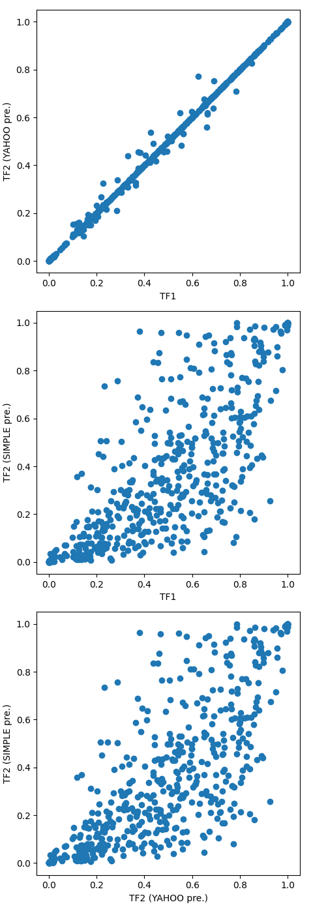

[](https://github.com/bhky/opennsfw2/actions)
[](LICENSE)

# Introduction

Detecting Not-Suitable-For-Work (NSFW) content is a high demand task in 
computer vision. While there are many types of NSFW content, here we focus on
the pornographic images and videos.

The [Yahoo Open-NSFW model](https://github.com/yahoo/open_nsfw) originally
developed with the Caffe framework has been a favourite choice, but the work 
is now discontinued and Caffe is also becoming less popular.
Please see the description on the Yahoo project page for
the context, definitions, and model training details.

This **Open-NSFW 2** project provides a TensorFlow 2 implementation of the
Yahoo model, with references to its previous third-party 
[TensorFlow 1 implementation](https://github.com/mdietrichstein/tensorflow-open_nsfw).

A simple API is provided for making predictions on images and videos.

# Installation

Tested for Python 3.8, 3.9, and 3.10.

The best way to install Open-NSFW 2 with its dependencies is from PyPI:
```shell
python3 -m pip install --upgrade opennsfw2
```
Alternatively, to obtain the latest version from this repository:
```shell
git clone git@github.com:bhky/opennsfw2.git
cd opennsfw2
python3 -m pip install .
```

# Usage

Quick examples for getting started are given below.
For more details, please refer to the [API](#api) section.

## Images

```python
import opennsfw2 as n2

# To get the NSFW probability of a single image.
image_path = "path/to/your/image.jpg"

nsfw_probability = n2.predict_image(image_path)

# To get the NSFW probabilities of a list of images.
# This is better than looping with `predict_image` as the model will only be instantiated once
# and batching is used during inference.
image_paths = [
  "path/to/your/image1.jpg",
  "path/to/your/image2.jpg",
  # ...
]

nsfw_probabilities = n2.predict_images(image_paths)
```

## Video

```python
import opennsfw2 as n2

# The video can be in any format supported by OpenCV.
video_path = "path/to/your/video.mp4"

# Return two lists giving the elapsed time in seconds and the NSFW probability of each frame.
elapsed_seconds, nsfw_probabilities = n2.predict_video_frames(video_path)
```

## Lower level with TensorFlow / Keras

```python
import numpy as np
import opennsfw2 as n2
from PIL import Image

# Load and preprocess image.
image_path = "path/to/your/image.jpg"
pil_image = Image.open(image_path)
image = n2.preprocess_image(pil_image, n2.Preprocessing.YAHOO)
# The preprocessed image is a NumPy array of shape (224, 224, 3).

# Create the model.
# By default, this call will search for the pre-trained weights file from path:
# $HOME/.opennsfw2/weights/open_nsfw_weights.h5
# If not exists, the file will be downloaded from this repository.
# The model is a `tf.keras.Model` object.
model = n2.make_open_nsfw_model()

# Make predictions.
inputs = np.expand_dims(image, axis=0)  # Add batch axis (for single image).
predictions = model.predict(inputs)

# The shape of predictions is (num_images, 2).
# Each row gives [sfw_probability, nsfw_probability] of an input image, e.g.:
sfw_probability, nsfw_probability = predictions[0]
```

# API

### `preprocess_image`
Apply necessary preprocessing to the input image.
- Parameters:
  - `pil_image` (`PIL.Image`): Input as a Pillow image.
  - `preprocessing` (`Preprocessing` enum, default `Preprocessing.YAHOO`): 
    See [preprocessing details](#preprocessing-details).
- Return:
  - NumPy array of shape `(224, 224, 3)`.

### `Preprocessing`
Enum class for preprocessing options.
- `Preprocessing.YAHOO`
- `Preprocessing.SIMPLE`

### `make_open_nsfw_model`
Create an instance of the NSFW model, optionally with pre-trained weights from Yahoo.
- Parameters:
  - `input_shape` (`Tuple[int, int, int]`, default `(224, 224, 3)`):
    Input shape of the model, this should not be changed.
  - `weights_path` (`Optional[str]`, default `$HOME/.opennsfw/weights/open_nsfw_weights.h5`): 
    Path to the weights in HDF5 format to be loaded by the model. 
    The weights file will be downloaded if not exists.
    If `None`, no weights will be downloaded nor loaded to the model.
    Users can provide path if the default is not preferred. 
    The environment variable `OPENNSFW2_HOME` can also be used to indicate
    where the `.opennsfw2/` directory should be located.
- Return:
  - `tf.keras.Model` object.

### `predict_image`
End-to-end pipeline function from the input image to the predicted NSFW probability.
- Parameters:
  - `image_path` (`str`): Path to the input image file. 
    The image format must be supported by Pillow.
  - `preprocessing`: Same as that in `preprocess_image`.
  - `weights_path`: Same as that in `make_open_nsfw_model`.
  - `grad_cam_path` (`Optional[str]`, default `None`): If not `None`, e.g., `cam.jpg`,
    a [Gradient-weighted Class Activation Mapping (Grad-CAM)](https://keras.io/examples/vision/grad_cam/) 
    overlay plot will be saved, which highlights the important region(s) of the 
    (preprocessed) input image that lead to the prediction.
  - `alpha` (`float`, default `0.5`): Opacity of the Grad-CAM layer of the plot,
    only valid if `grad_cam_path` is not `None`.
- Return:
  - `nsfw_probability` (`float`): The predicted NSFW probability of the image.

### `predict_images`
End-to-end pipeline function from the input images to the predicted NSFW probabilities.
- Parameters:
  - `image_paths` (`Sequence[str]`): List of paths to the input image files. 
    The image format must be supported by Pillow.
  - `batch_size` (`int`, default `8`): Batch size to be used for model inference. 
    Choose a value that works the best with your device resources.
  - `preprocessing`: Same as that in `preprocess_image`.
  - `weights_path`: Same as that in `make_open_nsfw_model`.
  - `grad_cam_paths` (`Optional[Sequence[str]]`, default `None`): If not `None`,
    the corresponding Grad-CAM plots for the input images will be saved.
    See the description in `predict_image`.
  - `alpha`: Same as that in `predict_image`.
- Return:
  - `nsfw_probabilities` (`List[float]`): Predicted NSFW probabilities of the images.

### `Aggregation`
Enum class for aggregation options in video frames prediction.
- `Aggregation.MEAN`
- `Aggregation.MEDIAN`
- `Aggregation.MAX`
- `Aggregation.MIN`

### `predict_video_frames`
End-to-end pipeline function from the input video to predictions.
- Parameters:
  - `video_path` (`str`): Path to the input video source. 
    The video format must be supported by OpenCV.
  - `frame_interval` (`int`, default `8`): Prediction will be done on every this 
    number of frames, starting from frame 1, i.e., if this is 8, then 
    prediction will only be done on frame 1, 9, 17, etc.
  - `aggregation_size` (`int`, default `8`):
    Number of frames for which their predicted NSFW probabilities will be aggregated.
    For instance, if a prediction will be done "on" frame 9 (decided by `frame_interval`),
    then it actually means prediction will be done on `aggregation_size` frames 
    starting from frame 9, e.g., frames 9 to 16 if the size is 8. 
    The predicted probabilities will be aggregated. After aggregation, 
    each of these frames in that interval will be assumed the same aggregated probability.
  - `aggregation` (`Aggregation` enum, default `Aggregation.MEAN`): 
    The aggregation method.
  - `batch_size` (`int`, default `8`, upper-bounded by `aggregation_size`): 
    Batch size to be used for model inference. Choose a value that works the best 
    with your device resources.
  - `output_video_path` (`Optional[str]`, default `None`): 
    If not `None`, e.g., `out.mp4`,
    an output MP4 video with the same frame size and frame rate as
    the input video will be saved via OpenCV. The predicted NSFW probability 
    is printed on the top-left corner of each frame. Be aware that the output 
    file size could be much larger than the input file size.
    This output video is for reference only.
  - `preprocessing`: Same as that in `preprocess_image`.
  - `weights_path`: Same as that in `make_open_nsfw_model`.
  - `progress_bar` (`bool`, default `True`): Whether to show the progress bar.
- Return:
  - Tuple of `List[float]`, each with length equals to the number of video frames.
    - `elapsed_seconds`: Video elapsed time in seconds at each frame.
    - `nsfw_probabilities`: NSFW probability of each frame. 
      For any `frame_interval > 1`, all frames without a prediction 
      will be assumed to have the NSFW probability of the previous predicted frame.

# Preprocessing details

## Options

This implementation provides the following preprocessing options.
- `YAHOO`: The default option which was used in the original 
  [Yahoo's Caffe](https://github.com/yahoo/open_nsfw/blob/master/classify_nsfw.py#L19-L80) 
  and the later 
  [TensorFlow 1](https://github.com/mdietrichstein/tensorflow-open_nsfw/blob/master/image_utils.py#L4-L53) 
  implementations. The key steps are:
  - Resize the input Pillow image to `(256, 256)`.
  - Store the image as JPEG in memory and reload it again to a NumPy image 
    (this step is mysterious, but somehow it really makes a difference).
  - Crop the centre part of the NumPy image with size `(224, 224)`.
  - Swap the colour channels to BGR.
  - Subtract the training dataset mean value of each channel: `[104, 117, 123]`.
- `SIMPLE`: A simpler and probably more intuitive preprocessing option is also provided,
  but note that the model output probabilities will be different.
  The key steps are:
  - Resize the input Pillow image to `(224, 224)`.
  - Convert to a NumPy image.
  - Swap the colour channels to BGR.
  - Subtract the training dataset mean value of each channel: `[104, 117, 123]`.

## Comparison

Using 521 private test images, the NSFW probabilities given by 
three different settings are compared:
- [TensorFlow 1 implementation](https://github.com/mdietrichstein/tensorflow-open_nsfw) with `YAHOO` preprocessing.
- TensorFlow 2 implementation with `YAHOO` preprocessing.
- TensorFlow 2 implementation with `SIMPLE` preprocessing.

The following figure shows the result:



The current TensorFlow 2 implementation with `YAHOO` preprocessing
can totally reproduce the well-tested TensorFlow 1 result, 
with small floating point errors only.

With `SIMPLE` preprocessing the result is different, where the model tends 
to give lower probabilities over the current test images.

Note that this comparison does not conclude which preprocessing method is 
"better", it only shows their discrepancies. However, users that prefer the
original Yahoo result should go for the default `YAHOO` preprocessing.
